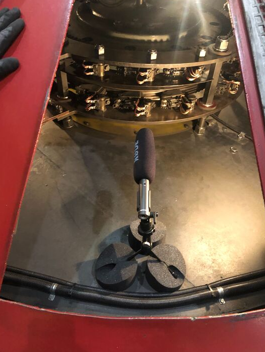
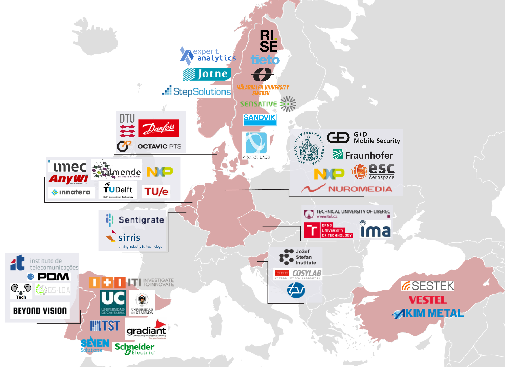

Starting in May 2021, Expert Analytics is participating in the European Horizon2020 project
[Distributed Artificial Intelligent Systems - DAIS](https://dais-project.eu/).

Together with our Norwegian partners Step Solutions and Jotne EPM, Expert Analytics is developing
methods for distributed artificial intelligence applied to high frequency data. This enables us to
monitor the health status of industry assets without having to send large amounts of data to the
cloud for analysis. This is particularly beneficiary for assets in remote locations with limited
access to bandwidth, like hydropower, shipping and offshore industry.

<!--more-->

As part of the DAIS-project, we are responsible for developing machine learning
models that are able to train and run on EDGE-devices, aggregate learning from multiple local devices,
securely control events, and communicate results to a centralized service. Applied to a hydropower use-case,
we will pilot and demonstrate the results of pushing AI to the EDGE.

DAIS is a joint industry collaboration project including 47 European partners from 11 countries.
The partners range from universities and research institutes to SMEs and large industry.
Spanning over 3 years the project has a total budget of 36 M€ and is funded by Horizon2020 and
the national research councils across Europe. We look forward to participate, make new acquaintances
and learn from our partners.
