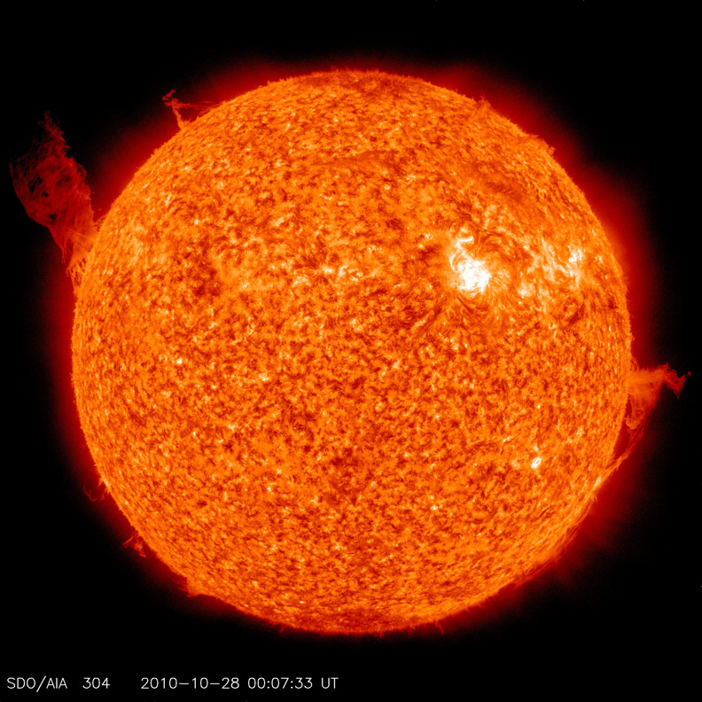

What will happen to the Sun when it dies?

The article entitled “What will happen to the Sun when it dies?” was published in the Spanish newspaper El Pais on October 2, 2019. El Pais is the main general newspaper in Spain. The article (in Spanish) can be found [here](https://elpais.com/elpais/2019/09/30/ciencia/1569831387_907062.html). Ada is a data scientist at Expert Analytics with a background in academia. Her field of research is Solar Physics, and in addition to doing research she communicates science within education & outreach activities.

<!--more-->
The article explains, in a plain language, the last stages in the Sun’s life: right now the Sun (and any other star in normal conditions) is in hydrostatic equilibrium, which means that the gravity force and the gas pressure compensate each other. The Sun is currently 4.6 billion years old, and it’s in a phase of its life called main sequence, in which stars burn hydrogen in their cores producing helium. Once it burns all the hydrogen in its core by nuclear fusion, the star won’t be in equilibrium anymore and it will shrink.

This is the beginning of the end: the shrinking will heat the core to a temperature high enough to burn the next element, helium. At the same time the outer layers of the Sun will expand round 200 times its current diameter becoming a red giant (and maybe engulfing planet Earth). Again, equilibrium won’t be possible anymore once the core runs out of helium, the outer layers will be expelled into the interstellar medium (this beautiful remnants are called a planetary nebula) and the center will become a white dwarf, eventually fading and becoming dark. At that point the Sun won't be visible from anywhere, but for that we’ll have to wait another 5 billion years.

Credit: "Courtesy of NASA/SDO and the AIA, EVE, and HMI science teams."
