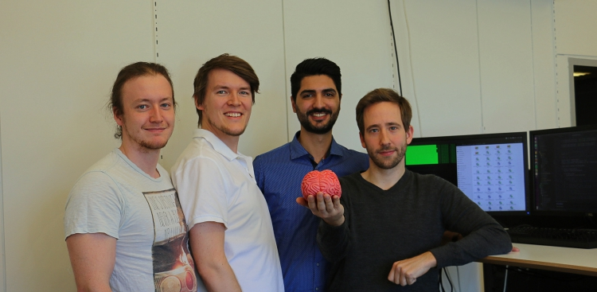

Simen Tennøe recently defended his PhD thesis in computational neuroscience.
In this context, the University of Oslo interviewed him along with two of his
co-PhD students on the cross-disciplinary work they have performed during their PhDs.

You can read the article [here](https://titan.uio.no/node/3368) (in Norwegian).
For the especially interested, a longer summary of his PhD can be found
[here](https://www.mn.uio.no/ifi/forskning/aktuelt/arrangementer/disputaser/2019/pressemelding_tennoe.pdf).

<!--more-->

From left: Andreas Solbrå, Svenn-Arne Dragly, Milad Mobarhan and Simen Tennøe.
Photography: Elina Melteig/UiO
